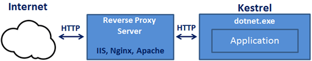

# Kestrel with Revers Proxy

**Kestrel** can also be used in combination with a reverse proxy server, such as **IIS**, **Nginx**, or **Apache**

Why do we need a reverse proxy server?
it provides an additional layer of configuration and security. 
It might integrate better with the existing infrastructure. 
It can also be used for load balancing. 

| | | |
|-|-|-|
 |  |  |
| | |